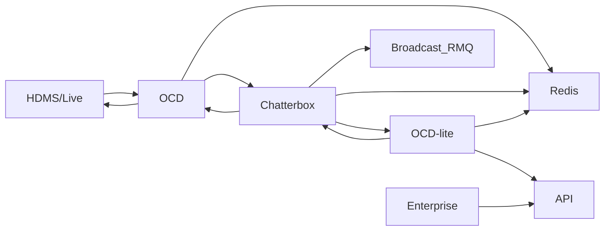

# Proposal for OCD-lite

## Purpose

Currently OCD is taking on too much responsiblity as a backend application.  See ocd-chatterbox for more
details.  In an ideal world we would make two different apps, one for the API and other for the content servers,
however the current implementation of OCD is very difficult to decouple.
So in lieu of creating seperate micro-services we will introduce a configuration switch that will us to deploy two different versions of OCD.

- OCD - This will be responsible for pushing content, database updates, and software to the systems.
- Lite OCD - This will be responsible for exposing the endpoints for enterprise (both 2 and X).

## Responsibilities 

OCD
1. Pushing content to HDMS.
2. Getting database updates.
3. Update software versions to the systems.

Lite OCD
1. Exposing all the endpoints usually provided by OCD. It would be dedicated to the front end. 
It is only an API server with all the OCD logic in it. It doesn't do background top-up content, databases, or software. 
(API top-up would still happen)

## Basic architecture



### OCD workflow

1. HDMS/Live provides access to the system.  
2. Only OCD provides content delivery to the systems.
3. Chatterbox handles the status of the jobs running on OCD and OCD-lite.
4. Both OCD and OCD-lite need redis to store shared state.
5. Only OCD-lite will expose the API.
6. Enterprise (front-end) consumes that API.

## Current plan

We will make a configuration variable that will tell OCD to switch between "main" and "lite" modes.  In doing so we need to determine two things.

1. What OCD-lite stuff needs to be turned off.
2. What OCD stuff needs to be turned off.
3. How are we going to deploy two different apps off of the same codebase?

## What OCD-lite stuff needs to be turned off.

1. For OCD light - Turn off timers for:
    1. Software server - uses an event for system online events
    2. Database server - push database job every X seconds.
    3. Tricklefeed server - this is for pushing content
2. Look into the missingEvent function that is triggers on a database rebuild

1.1. Software server timer:
```typescript
    // Software server
    // start job timer
    this.updateSystemSoftware.start()
    // update system software
    start() {
        this.task.interval = this.quickCheckTime
    }
    this.quickCheckTime = 20
    // tasksScheduler
    start() {
        let currentTime: [number, number] = process.hrtime([0, 0])
        this.taskList.forEach((task) => {
            task.lastRan = currentTime
        })
        this.runTasks()

        setInterval(() => { this.runTasks() }, 1000)  // loop every 1 sec
    }

    runTasks() {
        // the live server has stopped wait until it starts again
        if (this.paused)
            return

        this.taskList.forEach((task) => {
            let currentTime: [number, number] = process.hrtime(task.lastRan)
            if (currentTime[0] >= task.interval) {
                task.lastRan = process.hrtime()
                task.performTask()
            }
        })
    // task
    export class Task {

        public interval: number            // the frequency at which to fire off this task (Seconds)
        public lastRan: [number, number]   // the last time this task was run
        public performTask: any            // the function to run at said interval   
        public name: string
```
Explaination:
When a software push is requested, eventually a job is created to update software versions.  This task is set to a timer that is changed when the
start function is envoked on the updateSystemSoftware class. The tighter the this.quickCheckTime the more frequently we fire the job and trigger the
software update.

1.2 Database server timer:

Explaination:
Similar to the software server.  The start() function in tasksScheduler is starting this loop of running tasks.
If we skip over that it will not constantly be checking the database version.

1.3 Tricklefeed server timer:

```typescript
    this.task = new Task(120, () => { this.startNewDownloads() }, 'New Downloads Task')
    this.ocdService.taskScheduler.addTask(this.task)
    this.ocdService.taskScheduler.addTask(this.cleanUpDatabaseController.task)
    this.ocdService.taskScheduler.addTask(this.erroredJobsController.task)
    ...
```

Explaination:
It creates a task to start downloads.  Its interval gets adjusted at various parts of the controller.
May have to skip over the task unless an API depends on it.

2.0 Database rebuilt event
```typescript
    // pre 4.2 systems
    this.rpc.addEventHandler("nl-ocd.default.event", 
        "nl-hdms.event.update_system.set_missing_songs", this.onMissingSongs.bind(this), undefined)
    // this is for 4.2+ systems
    this.rpc.addEventHandler("nl-ocd.default.event", 
        "nl-hdms.event.update_system.database_rebuilt", this.onMissingSongs.bind(this), undefined)
```

Explaination:
The hdms fires an event that tells ocd to rebuild the database.  We want to turn this off for ocd-lite.
We actually want to turn off the consumemessage function since RMQ events will be handled by OCD.

## What OCD stuff needs to be turned off.

Add a switch to turn the handlers off:

```typescript
    if (!this.debug) { <-- add switch here
        this.rpc.addRpcHandler(nl_ocd_gen.server.configuration.set.METHOD, 
            this.service.serverConfigurationController.processServerConfigurationRequest
                .bind(this.service.serverConfigurationController), null, validate)
        this.rpc.addRpcHandler(nl_ocd_gen.server.configuration.get.METHOD, 
            this.service.serverConfigurationController.processServerConfigurationGetRequest
                .bind(this.service.serverConfigurationController), null, validate)

        this.rpc.addRpcHandler(nl_ocd_gen.server.errors.get.METHOD, 
            ErrorsController.instance.processErrorsGetRequest
                .bind(ErrorsController.instance), null, validate)
        this.rpc.addRpcHandler(nl_ocd_gen.server.errors.remove.METHOD, 
            ErrorsController.instance.processErrorsRemoveRequest
                .bind(ErrorsController.instance), null, validate)

        this.rpc.addRpcHandler(nl_ocd_gen.content.getSystemListDetails.METHOD, 
            this.trickleFeedServer.processGetSystemDetailsRequest
                .bind(this.trickleFeedServer), null, validate)
        this.rpc.addRpcHandler(nl_ocd_gen.content.updateSystemLists.METHOD, 
            this.trickleFeedServer.processUpdateSystemListsRequest
                .bind(this.trickleFeedServer), null, validate)
        this.rpc.addRpcHandler(nl_ocd_gen.content.getSystemReport.METHOD, 
            this.trickleFeedServer.processSystemsReportRequest
                .bind(this.trickleFeedServer), null, validate)
        ...
```

## How are we going to deploy two different apps off of the same codebase?

In summary deloyments are handled with 2 files.

1. The package.json - this determines the build of the application.
2. The helm_values.yaml - the determines the deployment environment of the application when put on the cluster.

Both OCD and OCD-lite will use the same image.
However they will have different configuration from two different helm files.

```yaml
# for OCD
name: nl-ocd
version: 1.9.26
# same image
image: 174155838907.dkr.ecr.ap-southeast-2.amazonaws.com/nl-ocd:1.9.26
command:
  - ts-node
  - src/main.ts
  - -P tsconfig.run.json
env:
  PWD: /app/backend/nl-ocd/src
  NLCONF_LOG__LEVEL: info
  NLCONF_LOG__PRETTY: 'false'
  NLCONF_RMQ__HOST: ha-rmq.rmq.svc.cluster.local
  NLCONF_ISOCDLITE: 'false' <-- configuration switch
```

```yaml
# for OCD-lite
name: nl-ocd-lite
version: 1.9.26
image: 174155838907.dkr.ecr.ap-southeast-2.amazonaws.com/nl-ocd:1.9.26
command:
  - ts-node
  - src/main.ts
  - -P tsconfig run json
env:
  PWD: /app/backend/nl-ocd/src
  NLCONF_LOG__LEVEL: info
  NLCONF_LOG__PRETTY: 'false'
  NLCONF_RMQ__HOST: ha-rmq.rmq.svc.cluster.local
  NLCONF_ISOCDLITE: 'true' <---- configuration switch
```

- To build ocd we use the build and deploy pipeline.
- To build ocd-lite we just deploy nl-ocd-lite.
