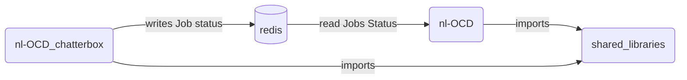

# Proposal for OCD chatterbox

## Context:
OCD is a management system for supporting the download of music lists for the HDMS.  Currently it handles the following tasks:

1. Accesses the content server.
2. Finds the systems that need a database update.
3. Creates and schedules jobs across OCD.
4. Exposes an API to update Enterprise X.
5. Manages events for all listeners.
6. Stores status of system if it is online or not.
7. Defines and stores tasks.
8. Tasks are managed via a trickle feed model where each task is run under a set interval.
9. Identify all systems that need updates.
10. Determines which song/lists are valid songs to download.
11. Determines which songs should be culled.
12. And much more..

OCD chatterbox is the first step in separating responsibility from OCD.  This would more closely adhere to a micro-service model, which is more maintainable and scalable. We will start with separating the functionality of job status.

## Requirements
* A new backend will be deployed on the production cluster.
* Any shared libraries will be moved to a more suitable location in mono.
* All shared state data will be stored in a Redis cache
* Metrics will be collected for the following parameters utilizing Prometheus:
```typescript
    // Both events already set up for RMQ, just send the same info to Prometheus
    sendStatusEvent(data: Array<nl_ocd.content.job.Status>) {
        if (this.service.rmqRpc !== undefined) {
            this.service.rmqRpc.emitEvent("job_status", data)
        }
    }
    this.service.rmqRpc.emitEvent("jobs_data", {
        job_count: jobsToSend.length,
        activte_jobs: activeCount,
        total_download_speed: downloadSpeed,
        active_ocd_jobs: ocdJobs,
        total_ocd_jobs: totalOCDJobs
    })
```

## What does the job status controller do?
Monitoring job status is accomplished through the jobStatusController.ts.

In summary, it does the following:  
* Looks for any jobs that are currently not being monitored by OCD.
    - Method:  updateDatabase()
* Updates the jobs that are monitored by OCD.
    - Method:  getAllJobsStatus()
    - Note: Both are accomplished by utilizing:
        - RPC requests to nl-hdms
        - Connecting to biggie-small and performing SQL queries.
- Find jobs that have errors and deletes them after a day or two.
    - Method: deleteEntry(entry: any)
- It runs these tasks in a timed loop but has the ability to add time when the traffic is higher than expected
    - Method: checkIfServerIsUnderLoad() to scale up

## Architectural Diagram




## Extract Libraries List

Libraries that need to be shared
```typescript
// from jobStatusController
import { Task } from '../tasks/task'
// change this away into regular queries
// this ORM stuff is "change as you go"
export interface OcdModels {
    status_monitor : any
    completed_jobs : any
    scheduled_jobs : any
    server_conf : any
    errors : any
    recently_checked : any
    list_activation_schedule : any
    content_server_access: any
}
// Controllers
ErrorsController
OnlineSystemsController
InternalSystemsController
// TaskScheduler each app will have its own scheduler
this.ocdService.taskScheduler.addTask(this.jobsStatusController.checkStatusTask)
this.ocdService.taskScheduler.addTask(this.jobsStatusController.sendStatusTask)
```
## Files that would compose OCD chatterbox

1. Jobstatus.ts - Main file that gathers all the system job status.
2. JobAPI.ts - Only used to expose an endpoint 
3. ActiveJobs.ts - Helper object that defines parameters of an active job.
4. CleanUpErroredUserJobsController.ts - update Errors table

## Stuff that would need to be "repurposed" within OCD

- OcdModels - will move query away from the ORM style. 
- The event handlers called that have to do with load balancing.
```typescript
    this.jobsStatusController.addListener("status", (data) => {
    this.ocdService.loadBalancing
        .updateStatus(data.system_id, data.paused, data.job_type)
    })
    this.jobsStatusController.addListener
                    ("update_job_status", (data) => {
    this.ocdService.loadBalancing.updateJobStatus(data)
    })
```

## What data needs to be stored in Redis?

### All shared state between the applications

- Task - no need to be shared.
- ErrorsController - this just queries the database. No shared state.
- OnlineSystemsController - seems like separate functions. No shared state
- InternalSystemsController - calls one function that needs systems array. This would be shared between both apps. Use redis to store the following:
    ```typecript
        private systems: Array<OnlineSystems> = []
        export interface OnlineSystems { 
            systemID: string
            lastCheck: Date
            status: string
     }
    ```
Note: This will need to be read and written from OCD.
- ActiveJobs - need to store the following:
    ```typescript
        private lastRecordedStatus: Array<nl_ocd.content.job.Status> = []
        export namespace job {

            export interface Status {
                system: string
                job_id: number
                status: string
                percent_completed?: string
                downloaded?: number
                total_files?: number
                download_speed?: string
                job_type?: string
                files_downloading?: Array<FileStatus>
            }
    ```

```typescript
// from jobStatusController
import { Task } from '../tasks/task'
// change this away into regular queries
// this ORM stuff is "change as you go"
export interface OcdModels {
    status_monitor : any
    completed_jobs : any
    scheduled_jobs : any
    server_conf : any
    errors : any
    recently_checked : any
    list_activation_schedule : any
    content_server_access: any
}
// Controllers
ErrorsController
OnlineSystemsController
InternalSystemsController
// TaskScheduler each app will have its own scheduler
this.ocdService.taskScheduler.addTask(this.jobsStatusController.checkStatusTask)
this.ocdService.taskScheduler.addTask(this.jobsStatusController.sendStatusTask)
```
- 

Notes from brad :

- 2 task managers no shared state
- Error controller no shared state, they just write to database
- OnlineSystemsController same as above
- InternalSystemsController need to store to redis specifically the Array<OnlineStatus> 
-   Note: this will need to have both read and write from redis
- Have cleanUpErroredUserJobsController in chatterbox
- Need activeJobs the lastRecordedArray in redis
- The two loadBalencing events could probably be moved to someone else in ocd


#### Data going from chatterbox to OCD
##### ErrorsController
```typescript
    private ocdService: OcdServiceContainer
    private ocdConfig: OcdConfig
    private maxSyncTime: number = 60 * 60 * 1000
    private syncingSystems: Array<SyncData> = []
    private checkCSA: Array<ErrorData> = []
    private csaTimer: NodeJS.Timer | undefined = undefined
```

##### OnlineSystemsController
```typescript
    public static instance: OnlineSystemsController
    private ocdService: OcdServiceContainer
    private ocdConfig: OcdConfig
    private onlineSystems: Array<OnlineSystems> = []
    private task: Task                                  
                        // run self at a time interval
    public timeTillNextCheck: number = 24 * 60 * 60     // reset once a day
    private timeOffset: number = 0
```
##### InternalSystemsController
```typescript
    private ocdService: OcdServiceContainer
    private ocdConfig: OcdConfig
    private systems: Array<OnlineSystems> = []
    private task: Task
```

#### Data going from OCD to chatterbox

```typescript
    this.jobsStatusController
        .setTimeTillNextCheck(Number(row.info.replace(/"/g, '')))
    this.jobsStatusController
        .checkStatusTask.interval = this.jobsStatusController
                                        .getTimeTillNextCheck()
    this.jobsStatusController.updateDatabase()
```

```typescript
    this.jobsStatusController.addListener("status", (data) => {
    this.ocdService.loadBalancing
        .updateStatus(data.system_id, data.paused, data.job_type)
    })

    this.jobsStatusController.addListener
                    ("user_job_errors", (data) => {
    this.cleanUpErroredUserJobsController.setErrors(data)
    })

    this.jobsStatusController.addListener
                    ("update_job_status", (data) => {
    this.ocdService.loadBalancing.updateJobStatus(data)
    })
```
Proposed design: We would need to replace addListener/emit to RMQ Pub/Sub solution since we are firing methods from OCD.
### All the state that chatterbox produces

```typescript
// Service container
  ocdService: Object {util: Object, rpc: Rpc, rmq: RabbitMQ, …}
    __proto__: Object {constructor: , __defineGetter__: , __defineSetter__: , …}
    // Don't think chatterbox needs these
    backBlaze: BackBlazeController {_events: Object, _eventsCount: 0, _maxListeners: 100, …}
    csaReporter: ContentServerErrorReport {_events: Object, _eventsCount: 0, _maxListeners: 100, …}
    dnsLookUp: DNSLookUp {_events: Object, _eventsCount: 1, _maxListeners: undefined, …}
    eventManager: EventManager {events: Object, allEventListener: Array(0)}
    listCache: ListCache {lists: Array(0), lock: 0, quickCheckTime: 60, …}
    loadBalancing: ServerLoadBalanceController {_events: Object, _eventsCount: 0, _maxListeners: 100, …}
    policy: Policy {includeRegions: Array(0), includeGroups: Array(0), includeSystems: Array(0), …}
    jobManager: JobManager {_events: Object, _eventsCount: 0, _maxListeners: 100, …}
    // This will be part of chatterbox no need to store state
    jobAPIController: JobAPIController {_events: Object, _eventsCount: 0, _maxListeners: 100, …}
    masterServer: true
    // Will need this since we have tasks for both OCD and chatterbox unless we want to 2 schedulers
    taskScheduler: TaskScheduler {taskList: Array(6), count: 0, paused: false, …}
    // Skeletor libraries if we share config this should be the same
    redis: Redis {options: Object, _events: Object, _eventsCount: 0, …}
    rmq: RabbitMQ {_events: Object, _eventsCount: 0, _maxListeners: 100, …}
    rmqRpc: RmqRpc {_events: Object, _eventsCount: 0, _maxListeners: 100, …}
    rpc: Rpc {_events: Object, _eventsCount: 0, _maxListeners: 100, …}
    util: Object {log: Logger, app_meta: Object, global_config: Object, …}
    uuid: function v4(options, buf, offset) { … }
```

```typescript
// Configuration
  ocdConfig: Object {live_rep: Object, e_tracker: Object, live_db: Object, …}
    __proto__: Object {constructor: , __defineGetter__: , __defineSetter__: , …}
    // This should all be shared since we want consistant behavior across both apps. I suppose we
    // need to be a bit careful with credentials
    app_meta: Object {name: "", version: "1.11.5", namespace: "ocd", …}
    backblaze: Object {key: "", id: ""}
    benchmark: Object {incremental: false}
    check_job_status_time: 10
    concurrency: 4
    e_tracker: Object {username: "", password: "", host: "", …}
    free_drive_space_if_full: true
    http_server: Object {port: 3041}
    live_db: Object {username: "", password: "", host: "", …}
    live_db_write: Object {password: "", host: "", database: "hdmslive2", …}
    live_rep: Object {password: "", host: "", database: "hdmslive_rep", …}
    live_rmq: Object {vhost: "rmq-sm"}
    live_temp: Object {password: "", host: "", database: "hdmslive_tmp", …}
    log: Object {pretty: false, level: "info", path: "stdout.log", …}
    max_download_speed: "250K"
    max_files_in_a_download: 500
    max_listeners: 100
    max_systems_to_download: 100
    pausedKey: "Paused"
    profiling: Object {enabled: false, interval: "5s"}
    quick_check_time: 60
    recheck_system_time: 86400000
    redis: Object {host: ""}
    rmq: Object {host: "", vhost: "rmq-sm", pass: "", …}
    rmq_rpc: Object {rpc_timeout: "5m", event_queue_bindings: Object}
    rpc: Object {skeletor_benchmark: false}
    runningKey: "Running"
    send_csa_report: 604800000
    sequelize: Object {database: "", username: "", password: "", …}
    spotify: Object {password: "", host: "", database: "nl_spotify", …}
    time_till_next_check: 600
    ws_server: Object {}
```

```typescript
// Error Controller
ErroredJobsController {_events: Object, _eventsCount: 0, _maxListeners: 100, name: "ErroredJobsController", config: Object, …}
  Symbol(kCapture): false
  __proto__: BaseController {constructor: , reportErrors: , storeErrors: , …}
  _events: Object {}
  _eventsCount: 0
  _maxListeners: 100
  // Considerable amount of shared state between this and config & service container
  // we would want to inject the state from those to this
  app_meta: Object {name: "nl-ocd", version: "1.11.5", namespace: "ocd", …}
  benchmark: Benchmark {_events: Object, _eventsCount: 0, _maxListeners: 100, …}
  concurrency: 4
  config: Object {live_rep: Object, e_tracker: Object, live_db: Object, …}
  controller_name: "ErroredJobsController"
  initialCheck: 10
  log: Logger {_events: Object, _eventsCount: 0, _maxListeners: undefined, …}
  name: "ErroredJobsController"
  ocdConfig: Object {live_rep: Object, e_tracker: Object, live_db: Object, …}
  ocdService: Object {util: Object, rpc: Rpc, rmq: RabbitMQ, …}
  service: Object {util: Object, rpc: Rpc, rmq: RabbitMQ, …}
  task: Task {interval: 10, performTask: , lastRan: Array(2), …}
  timeTillNextCheck: 86400
```

```typescript
// Online Systems controller
  instance: OnlineSystemsController {_events: Object, _eventsCount: 0, _maxListeners: 100, …}
    Symbol(kCapture): false
    __proto__: BaseController {constructor: , updateServerConfiguration: , populate: , …}
    _events: Object {}
    _eventsCount: 0
    _maxListeners: 100
     // Considerable amount of shared state between this and config & service container
     // we would want to inject the state from those to this
    app_meta: Object {name: "nl-ocd", version: "1.11.5", namespace: "ocd", …}
    benchmark: Benchmark {_events: Object, _eventsCount: 0, _maxListeners: 100, …}
    config: Object {live_rep: Object, e_tracker: Object, live_db: Object, …}
    controller_name: "OnlineSystemsController"
    log: Logger {_events: Object, _eventsCount: 0, _maxListeners: undefined, …}
    name: "OnlineSystemsController"
    ocdConfig: Object {live_rep: Object, e_tracker: Object, live_db: Object, …}
    ocdService: Object {util: Object, rpc: Rpc, rmq: RabbitMQ, …}
    onlineSystems: Array(0) []
    service: Object {util: Object, rpc: Rpc, rmq: RabbitMQ, …}
    task: Task {interval: 86400, performTask: , lastRan: Array(2), …}
    timeOffset: 0
    timeTillNextCheck: 86400
```

```typescript
// Internal Systems Controller
  instance: InternalSystemsController {_events: Object, _eventsCount: 0, _maxListeners: 100, …}
    Symbol(kCapture): false
    __proto__: BaseController {constructor: , populate: , cleanupInternalSystems: , …}
    _events: Object {}
    _eventsCount: 0
    _maxListeners: 100
     // Considerable amount of shared state between this and config & service container
     // we would want to inject the state from those to this
    app_meta: Object {name: "nl-ocd", version: "1.11.5", namespace: "ocd", …}
    benchmark: Benchmark {_events: Object, _eventsCount: 0, _maxListeners: 100, …}
    config: Object {live_rep: Object, e_tracker: Object, live_db: Object, …}
    controller_name: "InternalSystemsConstroller"
    log: Logger {_events: Object, _eventsCount: 0, _maxListeners: undefined, …}
    name: "InternalSystemsConstroller"
    ocdConfig: Object {live_rep: Object, e_tracker: Object, live_db: Object, …}
    ocdService: Object {util: Object, rpc: Rpc, rmq: RabbitMQ, …}
    service: Object {util: Object, rpc: Rpc, rmq: RabbitMQ, …}
    systems: Array(0) []
```

```typescript
// Task
Task {interval: 5, performTask: , lastRan: Array(2), name: "New Downloads Task"}
  __proto__: Object {constructor: }
  interval: 5
  lastRan: Array(2) [0, 0]
  name: "New Downloads Task"
  performTask: () => { … }
```

```typescript
// Task Scheduler
TaskScheduler {taskList: Array(0), count: 0, paused: false, pausedTimer: undefined, pausedTimeOut: 600000}
  __proto__: Object {constructor: , addTask: , removeTask: , …}
  count: 0
  paused: false
  pausedTimeOut: 600000
  pausedTimer: undefined
  // As mentioned before not sure it we want one or two schedulers
  taskList: Array(0) []
```
