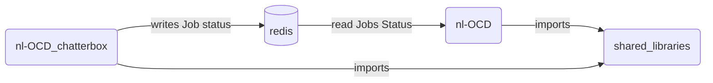

# Proposal for OCD chatterbox

## Context:
OCD is a management system for supporting the download of music lists for the HDMS.  Currently it handles the following tasks:

1. Accesses the contact server.
2. Updates the state of the systems.
3. Finds the systems that need a database update.
4. Creates and schedules jobs across OCD.
5. Exposes an API to update Enterprise X.
6. Manages events for all listeners.
7. Stores status of system if it is online or not.
8. Defines and stores tasks.
9. Tasks are managed via a trickle feed model where each task is run under a set interval.
10. Identify all systems that need updates.
11. Determines which song/lists are valid songs to download.
12. Determines which songs should be culled.
13. And much more..

OCD chatterbox is the first step in separating the of the responsibility from OCD.  This would more closely adhere to a micro-service model, which is more maintainable and scaleable. We will start with separating the functionality of job status.

## Requirements
* A new backend will be deployed on the production cluster.
* Any shared libraries will be moved to a more suitable location in mono.
* All shared state will be stored in a Redis cache
* Metrics will be collected for the following parameters utilizing Prometheus:
```typescript
    //Both events already set up for RMQ, just send the same info to Prometheus
    sendStatusEvent(data: Array<nl_ocd.content.job.Status>) {
        if (this.service.rmqRpc !== undefined) {
            this.service.rmqRpc.emitEvent("job_status", data)
        }
    }
    this.service.rmqRpc.emitEvent("jobs_data", {
        job_count: jobsToSend.length,
        activte_jobs: activeCount,
        total_download_speed: downloadSpeed,
        active_ocd_jobs: ocdJobs,
        total_ocd_jobs: totalOCDJobs
    })
```

## What does the job status controller do?
Monitoring job status is accomplished through the jobStatusController.ts.

In summary it does the following:  
* Looks for any jobs that are currently not being monitored by OCD.
    - Method:  updateDatabase()
* Updates the jobs that are monitored by OCD.
    - Method:  getAllJobsStatus()
    - Note: Both are accomplished by utilizing:
        - RPC requests to nl-hdms
        - Connecting to biggie-small and performing SQL queries.
- Find jobs that have errors and deletes them after a day or two.
    - Method: deleteEntry(entry: any)
- It runs these tasks in a timed loop but has the ability to add time when the traffic is higher then expected
    - Method: checkIfServerIsUnderLoad() to scale up

## Architectural Diagram




## Extract Libraries List

Libraries that need to be shared
```typescript
// from jobStatusController
import { Task } from '../tasks/task'
// from index.ts
export interface OcdModels {
    status_monitor : any
    completed_jobs : any
    scheduled_jobs : any
    server_conf : any
    errors : any
    recently_checked : any
    list_activation_schedule : any
    content_server_access: any
}
// Controllers
ErrorsController
OnlineSystemsController
InternalSystemsController
// TaskScheduler
this.ocdService.taskScheduler.addTask(this.jobsStatusController.checkStatusTask)
this.ocdService.taskScheduler.addTask(this.jobsStatusController.sendStatusTask)
```
## Files that would compose OCD chatterbox

1. Jobstatus.ts - Main file that gathers all the system job status.
2. JobAPI.ts - Only used to expose an endpoint 
3. ActiveJobs.ts - Helper object that defines parameters of an active job.

## What data needs to be stored in Redis?

### All shared state between the applications
Since the controllers are all called as instances we would need to store that state.

#### Data going from chatterbox to OCD
##### ErrorsController
```typescript
    private ocdService: OcdServiceContainer
    private ocdConfig: OcdConfig
    private maxSyncTime: number = 60 * 60 * 1000
    private syncingSystems: Array<SyncData> = []
    private checkCSA: Array<ErrorData> = []
    private csaTimer: NodeJS.Timer | undefined = undefined
```

##### OnlineSystemsController
```typescript
    public static instance: OnlineSystemsController
    private ocdService: OcdServiceContainer
    private ocdConfig: OcdConfig
    private onlineSystems: Array<OnlineSystems> = []
    private task: Task                                  
                        // run self at a time interval
    public timeTillNextCheck: number = 24 * 60 * 60     // reset once a day
    private timeOffset: number = 0
```
##### InternalSystemsController
```typescript
    private ocdService: OcdServiceContainer
    private ocdConfig: OcdConfig
    private systems: Array<OnlineSystems> = []
    private task: Task
```

#### Data going from OCD to chatterbox

```typescript
    this.jobsStatusController
        .setTimeTillNextCheck(Number(row.info.replace(/"/g, '')))
    this.jobsStatusController
        .checkStatusTask.interval = this.jobsStatusController
                                        .getTimeTillNextCheck()
    this.jobsStatusController.updateDatabase()
```

```typescript
    this.jobsStatusController.addListener("status", (data) => {
    this.ocdService.loadBalancing
        .updateStatus(data.system_id, data.paused, data.job_type)
    })

    this.jobsStatusController.addListener
                    ("user_job_errors", (data) => {
    this.cleanUpErroredUserJobsController.setErrors(data)
    })

    this.jobsStatusController.addListener
                    ("update_job_status", (data) => {
    this.ocdService.loadBalancing.updateJobStatus(data)
    })
```
Proposed design: We would need to replace addListener/emit to RMQ Pub/Sub solution since we are firing methods from OCD.
### All the state that chatterbox produces

