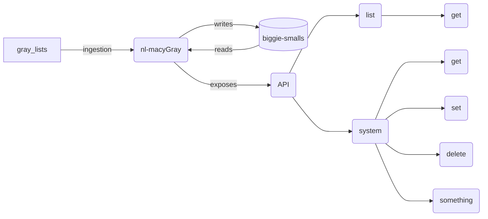

[##](##) Notes

timebomb - number of days remaining since a customer has downloaded music on the system.


total_timebomb - total number of days its been since the customer has downloaded music on the system.  Timebomb is a subset of total_timebomb. 

Are timebombs only 2 digits?
  yes 

Questions:
1. Do want to protect against wild cards in the query somehow? Especially the delete.<br>
We do not want to allow delete of wildward
3. Proposal for how to abstract out the timebomb:<br>
#### Pauls proposal
* if total time is greater then 90
  - set remaining time to 99
* if total time is less then 90
  - set remaining to total time
#### Sharans proposal
* always set remaining time to 99
* just store total time

3. Do we want to require serial, system pairing?  Do we request either or system or serial?  In other words do we assume the user wants to relate the two in someway?<br>
For example,
```
  systems = ["abcd", "efgh"]
  serials = ["1234", "5678"]
```
Would we be making a request against 2 systems or potentially 4?<br>
Assume no pairings just do (or)<br>
4. For the delete/put methods what is this count?  Is it the number of records changed or the records added?
We just needed feedback on the table.  
Total rows, rows effected, rows added
  


## Requirements


The Greylist is list of rules for systems when they install software and music. It affects whether software and databases can install and how long a software license s valid for. The data for the greylist is currently stored in a text file at the following location:

http://intranet.nightlife.com.au/greyList

The data needs to move to a database and we need a set of CRUD APIs to manage that data, we also need to http link to the data in the same format as above.

Below is an attempt at describing the format of the gray list data:

[TIMEBOMB COUNTER],[SOFTWARE MUSIC INSTALLS],[SYSTEM CODE],[SERIAL NUMBER],[TOTAL TIMEBOMB]

e.g. 99SM,PRID00057,NMS1234,998

## Terminology

- TIMEBOMB COUNTER - Set the number of days until the software license expires. A value of 0 de-registers the system, a value of 99 does not change the current counter value
- SOFTWARE MUSIC INSTALLS - An S in the first position will allow software installs to occur on a system any other character will block software installs. An M in the second position will allow music installs to occur on a system. any other character will stop music from installing. Need to review for remote database installs.
- SYSTEM CODE - The system code of a media player for which the rule apply
- SERIAL NUMBER - The serial number of a media player for which the rule apply
- TOTAL TIMEBOMB - [Optional] The default time period for the software license is 90 days. The number in this field will set a different time period, generally used to extend the the license period beyond 90 days.
### Explanation
Live server has logs that are in a given format
```
99SM,SYSTEM_CODE,SERIAL_NUMBER
07SM,RAFF02A,HDS7769
07SM,ROBE02A,HDS7361
07SM,ROYA40A,HDS8103
07SM,SKIN02A,HDS6035
30SM,BELL22A,HDS7362
99?M,???????,HDS7872
99?M,CAMP07A,HDS6360,998
99?M,PRIN29B,NMS1922,998
99?M,SUGA13A,???????,90,4.23_Preview_Player
99SM,???????,NMS1125,998
99SM,???????,NMS2206,998
99SM,AVEO01A,???????,365
99SM,AVEO01B,???????,365
```

Question: What is this "4.23_Preview_Player" column?

## Endpoints

### JSON format option

#### Get_system_details
Return all the details for a particular system / systems.
 
Example request:
```JSON
{
  "jsonrpc": "2.0",
  "method": "get_system_details",
  "params": {
    "systems": ["AVEO01B", "AVEO01A"],
  }
}
```
Example response:
```JSON
{
  "jsonrpc": "2.0",
  "method": "get_system_details",
  "result": [
    {
      "timebomb": 99,
      "system": "AVEO01B",
      "serial_number": "???????",
      "total_timebomb": "",
      "allow_software_installs": true,
      "allow_music_installs": false
    },
    {
      "timebomb": 99,
      "system": "AVEO01A",
      ...
    },
  ]
}
```

#### Set_timebomb_for_systems
Set the timeout for the time bomb.

Example request:
 ```JSON
{
  "jsonrpc": "2.0",
  "method": "set_timebomb_for_system", "params": {
    "systems": ["AVEO01B", "AVEO01A"],
    "timebombs": [99, 06]
  }
}
```
Example response:
```JSON
{
  "jsonrpc": "2.0",
  "method": "set_timebomb_for_system",
  "result": [
    {
      "timebomb": 99,
      "system": "AVEO01B",
    },
    {
      "timebomb": 06,
      "system": "AVEO01A",
      ...
    },
  ]
}
```
#### Set_allow_software_for_system
Sets if the system is allowed to receive software updates or not.

Example request:
 ```JSON
{
  "jsonrpc": "2.0",
  "method": "set_allow_software_for_system",
  "params": {
    "systems": ["AVEO01B", "AVEO01A"],
    "allow_software_installs": [true, false]
  }
}
```
Example response:
```JSON
{
  "jsonrpc": "2.0",
  "method": "set_timebomb_for_system",
  "result": [
    {
      "system": "AVEO01B",
      "allow_software_installs": true,
      ...
    },
    {
      "system": "AVEO01A",
      "allow_software_installs": false,
      ...
    },
  ]
}
```
#### Set_allow_music_for_system
Sets if the system is allowed to receive music updates or not.
 
 Example request:
 ```JSON
{
  "jsonrpc": "2.0",
  "method": "set_allow_software_for_system",
  "params": {
    "systems": ["AVEO01B", "AVEO01A"],
    "allow_music_installs": [true, false]
  }
}
```
Example response:
```JSON
{
  "jsonrpc": "2.0",
  "method": "set_timebomb_for_system",
  "result": [
    {
      "system": "AVEO01B",
      "allow_music_installs": true,
    },
    {
      "system": "AVEO01A",
      "allow_music_installs": false,
      ...
    },
  ]
}
```
### Plain text format
#### Create_line
Adds a line to the table
 
Example request:
```JSON
{
  "jsonrpc": "2.0",
  "method": "create_line",
  "lines": {
     {
      "timebomb": 99,
      "system": "AVEO01B",
      "serial_number": "???????",
      "total_timebomb": "",
      "allow_software_installs": true,
      "allow_music_installs": false
    },
    {
      "timebomb": 99,
      "system": "AVEO01A",
      ...
    },
  }
}
```
Example response:
```text
99SM,SYSTEM_CODE,SERIAL_NUMBER
99S, AVEO01B, ??????, 
99S, AVEO01A, ??????, 
```
#### Get_list 
Get the entire list
Example request:
```JSON
{
  "jsonrpc": "2.0",
  "method": "get_list"
}
```
Example response:
```text
99SM,SYSTEM_CODE,SERIAL_NUMBER
07SM,RAFF02A,HDS7769
07SM,ROBE02A,HDS7361
07SM,ROYA40A,HDS8103
....
entire list
```

#### Get_line 
Get a line

Example request:
```JSON
{
  "jsonrpc": "2.0",
  "method": "get_line",
  "systems": ["AVEO01B", "AVEO01A"]
}
```
Example response:
```text
99SM,SYSTEM_CODE,SERIAL_NUMBER
99S, AVEO01B, ??????, 
99S, AVEO01A, ??????, 
```
#### Update_line 
Update a line
```JSON
{
  "jsonrpc": "2.0",
  "method": "update_line",
  "systems": [
    {
      "timebomb": 99,
      "system": "AVEO01B",
      ...
    },
    {
      "timebomb": 06,
      "system": "AVEO01A",
      ...
    },
  ]
}
```
Example response:
```text
99SM,SYSTEM_CODE,SERIAL_NUMBER
99S, AVEO01B, ??????, 
99S, AVEO01A, ??????, 
```
#### Delete_line 
Delete a line

Example request:
```JSON
{
  "jsonrpc": "2.0",
  "method": "delete_line",
  "systems": ["AVEO01B", "AVEO01A"]
}
```
Example response:
```text
99SM,SYSTEM_CODE,SERIAL_NUMBER
99S, AVEO01B, ??????, 
99S, AVEO01A, ??????, 
```

This may be already created from nl-thumbs up
- set_serial_number - Set the serial number for a system


## Basic Architecture

### Flow Diagram



## Plan
1. Test out some different ingestion libraries and look at trade offs.
2. Wrap that into a simple express app.
3. Inject typescript afterwords to set up ideal interfaces.
4. Build up backend using nl-genesis.
5. Create some queues from RMQ.
6. Construct a dummy endpoint to test connections.  Both RMQ and HTTP.
7. Construct dummy table to biggie smalls to test that connection.
8. Create a schema from the gray list.
9. Build endpoints one by one. 
10. (Optional) Make some tests.
11. Create some docs to help consumers of API.  Ask about JSON-shema and how it can auto-generate these docs.
12. Build and deploy this application to development.
  
### Nice to have for the future:
- May want a groups a tables to set for the cruise ships.  This would be group -> systems codes.


Notes from sharan
